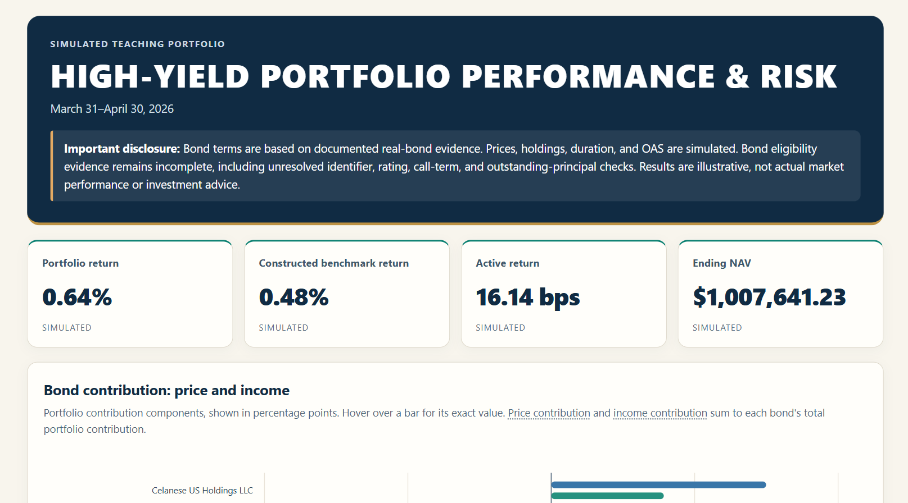

# High-Yield Portfolio Performance & Risk

A ten-bond fixed-income analytics case study covering March 31–April 30,
2026. It combines documented contractual terms, simulated market and risk
inputs, full-precision Python calculations, and PostgreSQL reconciliation
controls.

## Dashboard preview


- [Interactive dashboard (self-contained HTML)](outputs/portfolio_dashboard.html)

## Analysis and results

- [Portfolio manager note](outputs/portfolio_manager_note.md)
- [Bond research and sources](docs/BOND_RESEARCH.md)
- [Implemented SQL workflow and limitations](docs/SQL_DESIGN.md)

Download the dashboard HTML and open it in a browser; it does not require
a server or external libraries.

| Measure | Result |
|---|---:|
| Portfolio return | 0.642583% |
| Constructed benchmark return | 0.481158% |
| Active return | 16.14 bps |
| Ending portfolio NAV | $1,007,641.23 |
| Ending portfolio effective duration | 3.034 years |
| Ending portfolio average bond OAS | 324.5 bps |
| Ending portfolio cash weight | 1.259% |

The figures are from `outputs/performance_summary.csv` and
`outputs/risk_exposure_summary.csv`.

**Output conventions:** Returns and weights are stored as decimals at full
calculation precision. Monetary values are USD unless labeled per $100 face.
The benchmark is a constructed same-universe benchmark, not a market index.

## Methodology and controls

Python calculates accrued interest (AI), coupon cash, dirty prices, bond
returns, portfolio contributions, benchmark performance, and risk
exposures. Dirty price equals clean price plus AI. Total return includes
coupon cash retained at zero interest and uses beginning dirty value as its
base. Portfolio contribution weights are based on beginning dirty market
values divided by beginning NAV.

The constructed benchmark allocates 10% of beginning dirty-market-value
capital to each bond, derives fractional face amounts, and holds those
positions fixed. It is not a market index.

Python checks the Celanese worked example, NAV and contribution
reconciliations, benchmark and active-return reconciliations, beginning
benchmark duration/OAS, and bond-plus-cash NAV weights. The dashboard
builder validates required files, columns, bond/date coverage, statuses,
and finite numeric values.

SQL checks 06–09 were manually run in a local PostgreSQL database through
pgAdmin and returned passing results. They cover dirty values and NAV,
beginning weights and contributions, constructed benchmark returns and
active attribution, and portfolio/benchmark risk coverage and weights.
These checks do not compare every calculation against all Python summary
exports: SQL import/comparison tables for portfolio contributions, active
contributions, performance summary, and risk exposure summary are not
implemented.

## Data and limitations

Bond terms are documented, but eligibility evidence remains incomplete.
Some identifiers, dated ratings, call details, and outstanding-principal
checks are unresolved; the candidates are not represented as fully
verified high-yield eligible.

Prices, holdings, duration, and OAS are simulated. Allocations were chosen
after reviewing simulated returns, so results do not demonstrate
investment skill or represent actual performance. The project uses
30/360 US as its accrual convention; the reviewed contract excerpts do not
distinguish US from European 30/360. SQL relies on Python-imported AI and
coupon results and does not independently calculate coupon schedules or
accrued interest.

## Repository guide

| Location | Contents |
|---|---|
| `inputs/` | Four current CSV inputs: bond candidates, simulated prices, portfolio holdings, and simulated risk inputs |
| `outputs/` | Python exports, manager note, and self-contained dashboard |
| `docs/` | Bond research, project specification, SQL workflow design, and historical repository audit |
| `sql/` | PostgreSQL table definitions (01–05) and read-only reconciliation queries (06–09) |
| Repository root | README, requirements, three calculation scripts, and dashboard builder |

### PostgreSQL input mapping

| CSV file | PostgreSQL table | Table definition |
|---|---|---|
| `inputs/bond_candidates.csv` | `public.bond_master` | `sql/01_bond_master.sql` |
| `inputs/simulated_prices.csv` | `public.simulated_price` | `sql/02_simulated_price.sql` |
| `inputs/portfolio_holdings.csv` | `public.portfolio_holding` | `sql/03_portfolio_holding.sql` |
| `inputs/simulated_risk_inputs.csv` | `public.simulated_risk_input` | `sql/04_simulated_risk_input.sql` |
| `outputs/bond_returns.csv` | `public.bond_return_result` | `sql/05_bond_return_result.sql` |

## Reproduction

From the repository root with Python 3, run:

```powershell
python .\calculate_bond_returns.py
python .\calculate_portfolio_returns.py
python .\calculate_risk_exposures.py
python .\build_dashboard.py
```

The first three scripts run in dependency order and update `outputs/`;
the dashboard builder consumes the saved inputs and results. For PostgreSQL,
create tables with SQL 01–05 and import the corresponding CSVs above, then
run the read-only checks in order:

1. `sql/06_portfolio_reconciliation.sql`
2. `sql/07_weights_and_contributions.sql`
3. `sql/08_benchmark_reconciliation.sql`
4. `sql/09_risk_reconciliation.sql`
